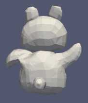
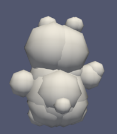
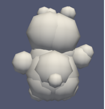

# indepent-study
Readme
Topic: Granular Dynamic Solver in Python

Introduction：
This project is for the Granular Dynamic Solver, which aims to model the object with several spheres because the sphere is analysis-friendly for the force. The number of spheres can be set by customers at the beginning, and the position and the radius of spheres can be computed by the algorithm. With the .obj files we created, the model can perform in the Paraview software.
The code contains two main parts, the judging part and the slicing part. After the iterations of judging and slicing, the object can be cut into several parts and represented by each mesh with one sphere. 
The code of judging part is finished by the weight equation, which contains three factors. The weird degree, the value of modification, and the volume ratio are contained in the weight equation. The corporation of all these factors makes the judgment comprehensive. The ratio of the shortest and the longest distance from the surface to the outer sphere center represents the Weird degree, and the value of modification can be calculated by taking the difference between the longest and the shortest distance from the surface to the outer sphere center being divided by the radius of the outer sphere. The ratio of the volume of the mesh and the volume of the whole object represents the volume ratio.
The workflow of slicing parts contains four steps. Finding the outer sphere of all convex points is the first step. Then, we can get the longest axis of the object through the center of the sphere. On the axis, we can set several pairs of points to represent the center of the two new spheres. The combination of the pairs of spheres will all have the same volume as the original object, which means if the spheres overlap, the overlapping part will not be involved in the volume computing. By comparing the distance between the convex points and the new sphere’s surface, we can choose the smallest pair of points to represent the two new spheres. The slicing surface is based on these new spheres. If two spheres contact, then the slicing surface is the contacting surface. If they do not, the distance from the slicing surface to the two center points will be the same as the ratio of radius. With the slicing surface, the mesh can be separated from one part to two parts.

How to install:
pip3 install pybullet --upgrade --user
pip3 install Pillow
pip3 install trimesh

How to use: 
Type this statement in your terminal: python3 convex_revised.py -i (input  file name in obj format) -o result.csv -c parts.obj -v 1000000 -r 0.6 
After that please give an input for this script to run. That input indicates how many times you want the function to run. The suggested number is from 1 to 5. Numbers that are out of this range might give you a bad result.

Examples,

The original object:

First iteration:

Third iteration:

Fifth iteration:

The football:
The original object:

Third iteration:

Links:                 
Xin WEI, Yulong YUE from the University of Wisconsin-madison
