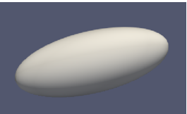
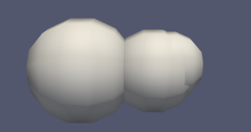

# indepent-study
Readme
Topic: Granular Dynamic Solver in Python

Introduction：

This project is for the Granular Dynamic Solver, which aims to model the object with several spheres because the sphere is analysis-friendly for the force. The object and the number of spheres can be set by customers at the beginning, and the position and the radius of spheres can be computed by the algorithm. With the .obj files we created, the model can perform in the Paraview software. The code contains two main parts, the judging part and the slicing part. After the iterations of judging and slicing, the object can be cut into several parts and represented by each mesh with one sphere. 

How to install:

pip3 install pybullet --upgrade --user

pip3 install Pillow

pip3 install trimesh

How to use: 

Type this statement in your terminal: python3 convex_revised.py -i (input  file name in obj format) -o result.csv -c parts.obj -v 1000000 -r 0.6 
After that please give an input for this script to run. That input indicates how many times you want the function to run. The suggested number is from 1 to 5. Numbers that are out of this range might give you a bad result.

Examples,

The original object:

First iteration:

Third iteration:

Fifth iteration:

The football:

The original object:

Third iteration:

Links:                 
Xin WEI, Yulong YUE from the University of Wisconsin-Madison
